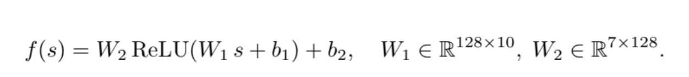
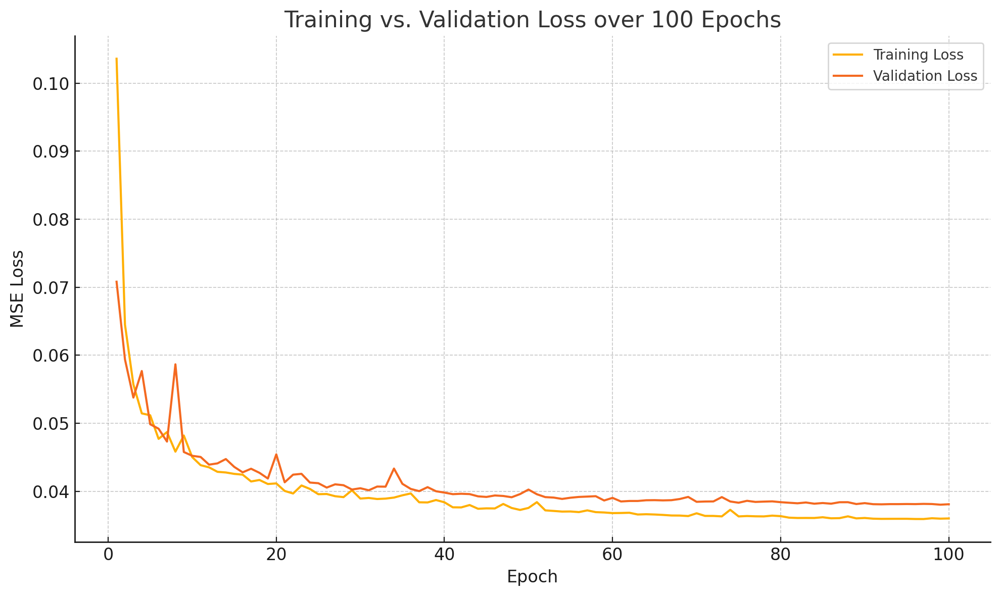

# Square Nut Assembly via Behavior Cloning

**Author:** Maanas Gantla

**Course:** COM SCI 188 (Spring 2025)  

## Problem Statement
The **NutAssemblySquare** environment randomizes a square nut’s position and orientation for each trial.  

This approach learns a closed-loop policy **π**, using low-dimensional state (3D end-effector position, 3D nut position, 4D nut quaternion) and mapping it to the 7D joint velocity vector, reliably inserting the nut onto its peg within a 2,500 time step limit.

## Methodology
- **Data Preprocessing**  
  - Loaded 200 demos from `demos.npz` via `load_data.py`.  
  - Extracted 10D state  and 7D action, then calculated zero-mean and unit-variance across each dimension.

- **Behavior Cloning Model**  
  - Two-layer MLP:  
    
  - The optimal hyperparameters used for training were: Mean Squared Error (MSE) loss, Adam (learning rate = 1e-3), batch = 256, 100 epochs, step-LR halving every 20 epochs.  
  - 90/10 train/validation split.

- **Alternative Methods Attempted**  
  - **Nearest-Neighbor:** replayed the single closest demo’s actions
  - **DMP+PID:** struggled to capture orientation changes and precise alignment

## Results
- **Behavior Cloning**: 41/50 trials → **82%** success rate.  
- **Learning Curves**:  
  - Final train loss approximated 0.035, while validation loss approximated 0.038.  
- **Hyperparameter Sweep**:

  | Hidden dim | Batch size | Learning rate | Success rate |
  |:----------:|:----------:|:-------------:|:------------:|
  | 64         | 128        | 1 × 10⁻³      | 68%          |
  | 64         | 256        | 1 × 10⁻³      | 70%          |
  | 128        | 128        | 1 × 10⁻³      | 75%          |
  | **128**    | **256**    | **1 × 10⁻³**  | **82%**      |
  | 128        | 256        | 5 × 10⁻⁴      | 78%          |

<!-- needed to add the exponents since they weren't loading for learning rate -->

## Discussion & Reflections

|  |  |
|:--------------------:|:--------------------:|
| (a) Failed trial     | (b) Successful trial |

Behavior cloning on the 10D state is **simple**, **fast**, and yields up to 82% success in minutes on CPU. The two-layer MLP converged quickly, whereas my other two strategies initally attempted:

- **Nearest-neighbor** failed to generalize to unseen nut poses  
- **DMP+PID** struggled with precise orientation alignment  

However, the neural network can **overfit** (e.g. if we increase with something like hidden = 256) and not learn the mapping between poses and actions. With only 200 demos, the net **interpolates** well but can’t **extrapolate** to rare poses. And since the environment’s sparse reward (r=1 only on success) supplies no corrective gradient, **fine-tuning via proximal policy optimization or (PPO)** would be the next steps for this research given more time to conduct such experiments.

## Demo Video

<iframe width="560" height="315" src="https://www.youtube.com/embed/vgVSUsx_pqk" frameborder="0" allowfullscreen></iframe>

## Code & Report

- [Download full report (PDF)](https://drive.google.com/file/d/1oZDFewvSXlhzwvzbncq7DOppmCW52wDL/view?usp=sharing)  
- [Source code on GitHub](https://github.com/MaanasGantla/CS188-Final-Project)

## Acknowledgements

I would like to thank the course staff of CS 188 for providing the demonstration data and a sample file that loads the demonstrations.
